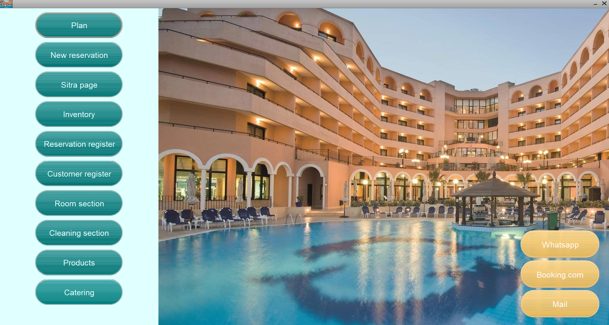
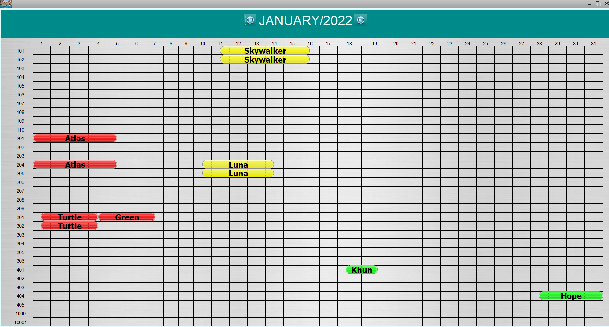
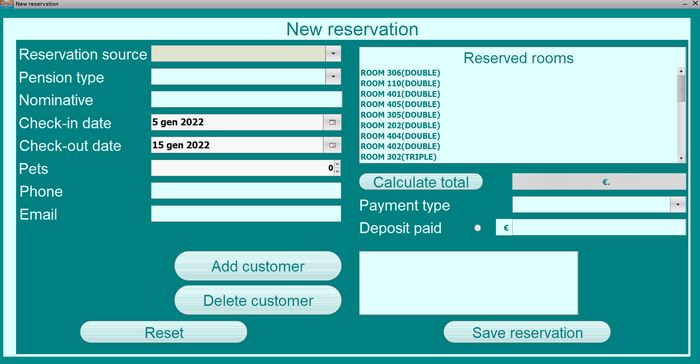
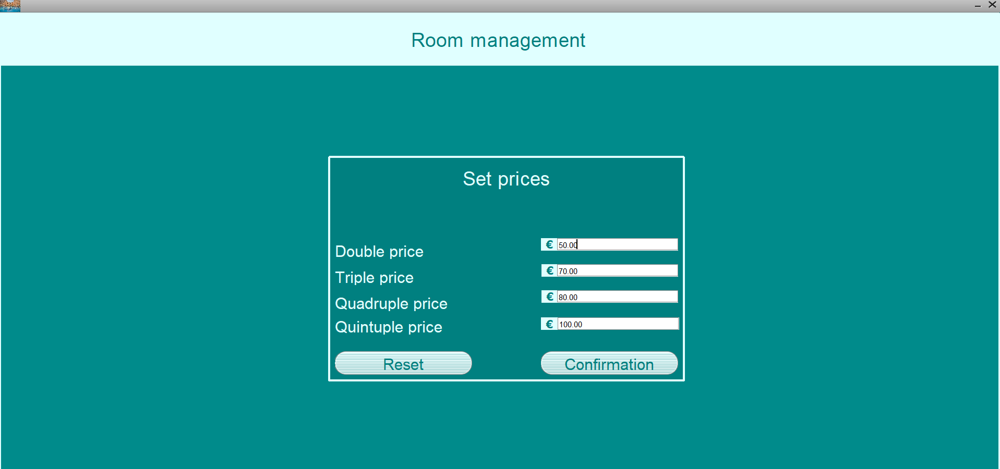
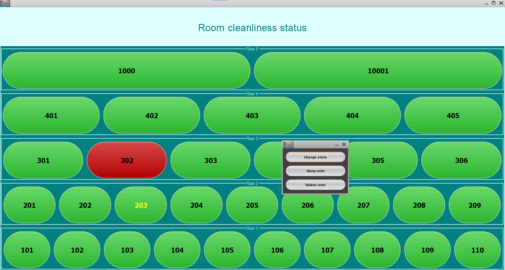

# Hotel Management System

A hotel management system desktop application, built with java SWT/Swing,
with tabs to manage bookings, rooms, customers, payments,
cancellations, hotel inventory orders, catering and a plan to visualize all the reservations for the month.

## Dashbord page

## Plan page

## Booking page

## Room management pages

And many other pages that you can check in the screenshot folder.

## Built with

- Java
- Java SWT/Swing
- Hibernate
- MySql
